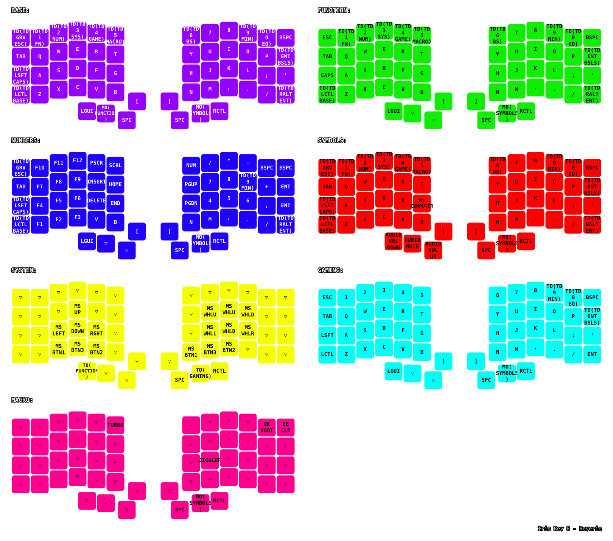

# Iris Reverie

My Keebio Iris Rev 8 custom keymap called "Reverie" -- a productivity-focused layout with sophisticated RGB lighting and tap dance functionality.


## Features

- **Per-layer RGB lighting** with distinct colors for each layer
- **Tap dance keys** for advanced functionality (numbers 1-5 switch layers on double-hold)
- **Containerized builds** using Podman for reproducible compilation
- **keymap-drawer integration** that automatically generates a PNG cheatsheet of all keymap layers
- **Custom macros** including TURBO and JIGGLER functionality

## Layer Architecture



### QWERTY (Layer 0) - Purple

**Base typing layer with advanced tap dance functionality:**

#### Tap Dance Functions
- **`~` (grave)**: Single tap for `~`, double tap for `Esc`
- **`1`**: Single tap for `1`, double-hold to switch to NUM layer
- **`2`**: Single tap for `2`, double-hold to switch to SYM/NAV layer  
- **`3`**: Single tap for `3`, double-hold to switch to MEDIA/MOUSE layer
- **`4`**: Single tap for `4`, double-hold to switch to GAMING layer
- **`5`**: Single tap for `5`, double-hold to switch to MACRO layer
- **`Left Shift`**: Single tap for shift, double tap for `Caps Lock`
- **`Left Ctrl`**: Single tap for ctrl, double tap for `Esc`
- **`Left GUI`**: Single tap for GUI, double tap for `Space`
- **`Right Alt`**: Single tap for Alt, double tap for `Enter`

#### Momentary Layers
- **`[` (left bracket)**: Hold for temporary SYM/NAV layer access
- **`]` (right bracket)**: Hold for temporary NUM layer access

### NUM (Layer 1) - Red

- **Top row**: F1-F12 function keys
- **Right side**: Full numpad layout with mathematical operators
- **Navigation arrows**: Integrated into the main typing area
- **Mouse keys**: Basic mouse controls (clicks and movement)


### SYM/NAV (Layer 2) - Azure

- **Left side**: Symbol characters ( ! @ # $ % ^ & * ( ) )
- **Right side**: Navigation cluster (arrows, home, end, page up/down, insert, delete)
- **Brackets**: Programming brackets ( [ ] { } < > ) and additional symbols


### MEDIA/MOUSE (Layer 3) - Orange/Yellow

- **Mouse controls**: Precise mouse movement, scrolling (wheel up/down), and all mouse buttons
- **Media keys**: Play/pause, next/previous track, volume controls
- **System controls**: Screen capture, application switching

### GAMING (Layer 4) - Blue

**Dedicated gaming layout:**

- **Clean WASD**: Uncluttered gaming controls with standard FPS layout
- **Quick access**: Essential gaming functions without interference
- **Stable layout**: No complex modifiers that could interfere with gaming

### MACRO (Layer 5) - White

**Custom macros and utilities:**

- **TURBO**: Rapid-fire macro for gaming or testing
- **JIGGLER**: Mouse movement simulator for preventing screen savers
- **System utilities**: Reset (QK_BOOT) and EEPROM clear (EE_CLR)
- **Layer switching**: Quick access to GAMING and QWERTY layers

## Build Instructions

### Prerequisites
- Podman (or Docker) for containerized builds
- Git for cloning repositories

### Building Firmware

1. **Clone or navigate to the repository**

2. **Run the build script:**
   ```bash
   ./build.sh
   ```

3. **The build process will:**
   - Download/Update QMK firmware
   - Build the container environment
   - Compile your firmware uf2 and keymap png/svg images
   - Output the files to `./build-volume/build-output/`
   - Copy the new keymap image to the assets folder so it will show in README.md

### Flashing Firmware

1. **Prepare both keyboard halves:**
   - Double-press the reset button under each half
   - Each half will appear as a USB storage device

2. **Flash the firmware:**
   - Mount both keyboard filesystems
   - Copy the `keebio_iris_rev8_reverie.uf2` file to both halves
   - The keyboards will automatically reboot with the new firmware

## Troubleshooting

### Build Issues
- Ensure Podman is running: `podman info`
- Clean build artifacts: `rm -rf build-volume/qmk_firmware/.build`
- Check container logs for detailed error messages

### Flashing Issues
- Ensure both halves are in bootloader mode (reset button double-press)
- Try different USB cables if the drives don't appear
- Verify the UF2 file size

## License

This keymap is licensed under the GPL-2.0-or-later license. 
